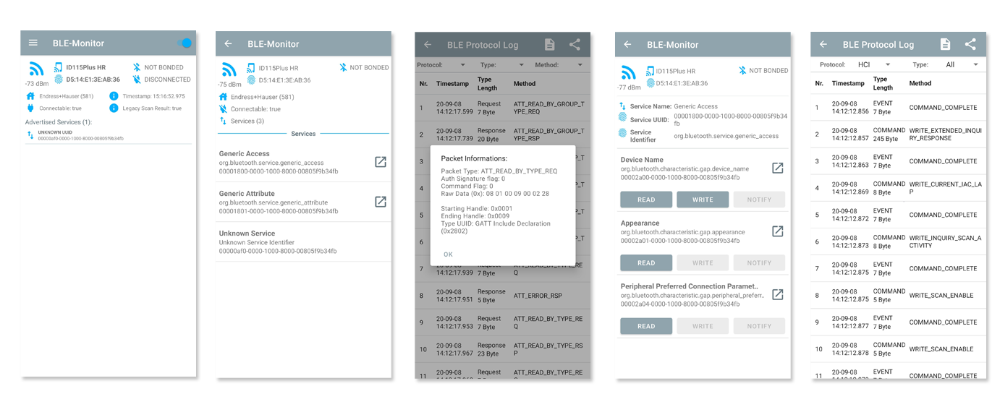

# Android-BLE-Monitor

 

Bluetooth Low Energy Monitor (BLEM) is an Android App which can be used to reverse engineer and analyze BLE Devices by using Android Snoop Logging and the Android BLE API. It is developed as part of a 2 Semester long Master Project at the University Reutlingen, Germany. The purpose of this app is to support the process of using not standardized BLE Devices (wearables) in a medical context.
### Download
<a href="https://github.com/mx0c/Android-BLE-Monitor/releases/">APK Download</a>

### Features
- Scan for BLE Devices and retrieve advertised Informations
- Connect to discovered GATT Servers
- Retrieve Services, Characteristics and Descriptors
- Identify standardized Services and Characteristics
- Interact with Characteristics and Descriptors
- HCI, L2CAP & ATT Log utilizing the Android Bluetooth [Snoop](https://tools.ietf.org/html/rfc1761) Log 

### Requirements
- Android Phone that supports BLE
- Android 5.0 (API level 21)
- _To use the BLE Protocols (ATT, L2CAP, HCI) Log the Android Bluetooth Snoop Log needs to be supported_

### Dependencies
- [Apache commons-lang3](https://github.com/apache/commons-lang)
- [EasyPermissions](https://github.com/googlesamples/easypermissions)
- [bluetooth-hci-decoder](https://github.com/bertrandmartel/bluetooth-hci-decoder)
- [btsnoop-decoder](https://github.com/bertrandmartel/btsnoop-decoder)
- [Android Material](https://material.io/develop/android)
- [Android Arch Lifecycle](https://developer.android.com/reference/android/arch/lifecycle/package-summary)
- [rv-adapter-states](https://github.com/rockerhieu/rv-adapter-states)
